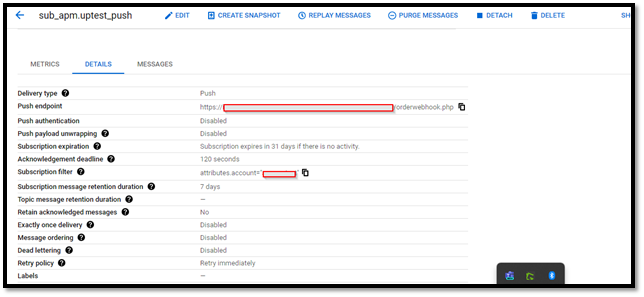
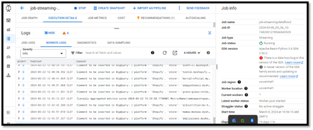

# Ecommerce Integrations Case Study

## Problem Statement
As part of a courier company (last-mile delivery), the first process for its operation (transportation and delivery of products) is the real-time capture of orders from various e-commerce platforms associated with it. The existing problem was that the different orders were initially loaded through an Excel manually into the system. This worked when there were few customers and the sales volume was also low. However, when the number of customers (associated e-commerce) as well as the sales volume grew, maintaining a manual loading model became unsustainable.

For each order in Excel, it was necessary to manually enter all the order data, such as buyer's name, product name, SKU, shipping method, delivery address, phone number, and many more data. It is worth noting that the associated stores do not use the same platform; initially, it was only Shopify, but later customers who used WooCommerce, VTEX, PrestaShop, Magento, JumpSeller, as well as stores with their own developments were incorporated, which meant that the source of information was never the same and a “system” was needed that could somehow automatically read every time an order was generated in real-time instead of being loaded into an Excel at the end of the day.

At this point, an architecture or system is analyzed that could solve a growing demand for both customers, orders, and e-commerce platforms, which could also be scalable in real-time when there are high sales dates like Christmas, Black Friday, promotions, etc.

The second problem is that orders, being loaded manually and massively, were very prone to the introduction of errors, resulting in long verification processes in the courier system, as well as associated costs.

## Solution Proposal
Initially, the ways in which each e-commerce platform could notify through its own webhook to an external system, which could be our courier company with an endpoint listening to each sale creation, were investigated. In most of the more modern platforms, this webhook was indeed configured but not in others, so the first challenge was to build a custom plugin in those platforms that required it to notify an external system. Having resolved this first point, the development of custom applications by the courier company begins, where they could receive notifications from the different stores of the various platforms.

It should be noted that in the same platform there are many customers with different stores and although the information format is the same according to the platform; there was a diversity of logics that each customer had and that had to be separated into different threads. For example, one store only delivered products from Regions and not from RM, so this distinction had to be made so as not to allow orders from RM to enter the courier system. Other stores, however, indicated that certain SKUs were to be excluded or shipping methods, or deeper multi-package logics were developed. Therefore, it was necessary for the endpoints to be different for each store and each platform, which added its own particularities to individual development.

Once the corresponding information of sales in real-time separated by stores is obtained in each corresponding application, the next challenge begins. It turns out that the webhooks of e-commerce platforms have their own rules, let's take the case of Shopify which is the most known, this webhook is responsible for sending the notification in real-time transmitting the entire body of the order in JSON format. However, the endpoint that receives it must not delay in responding to said webhook with a successful 200 OK notification because if it does not do so immediately (about 6 seconds) the webhook itself resends the message repeatedly 19 times after which it deletes the webhook and the receipt of orders in real-time “falls”.

Our endpoint that receives the JSON message of an order can only respond when it has processed all the information, so by notifying back to the webhook, it was already too late. Keep in mind that a raw JSON object is received, which must be disaggregated and only the information that is relevant to the courier system obtained, apply the filters and exclusions specific to each store, as well as send through a POST request to the courier system the processed order.

In many cases, when the connection with the webhook was not lost, what happened was that orders were duplicated in the courier system, even up to four times, due to the repetitions sent continuously of the same JSON object by the webhook. This way of webhook behavior, which cannot be modified, is nothing more than a security and performance measure on the part of e-commerce and is conceptually correct, but introduced a major problem to solve: the duplication of orders.

## Use of Google Cloud Platform Tools

**Pub/Sub:** Given the problem of order duplication and the need to immediately respond to webhooks, Pub/Sub was chosen for its ability to handle messaging effectively, allowing for an immediate response to the webhook and processing the information at leisure. This eliminates the problem of duplication and facilitates the management of orders in real time.

**Cloud Functions:** For platforms without direct integration with Pub/Sub, Cloud Functions were implemented as an intermediate step, receiving the notifications and publishing them on Pub/Sub. This ensures the continuity and reliability of the data flow. (**_See cloud_functions file_**)

**Dataflow:** The information flows into Dataflow, where the order data are structured and processed through Apache Beam pipelines, preparing them for storage in BigQuery. This allows for scalable and efficient management of the data volume. (**_See dataflow file_**)

**BigQuery:** Used to store historical order data, facilitating analysis and the extraction of relevant insights. The integration of BigQuery with Machine Learning tools, such as BigQuery ML and AutoML, enables the implementation of predictive and classification models directly on the stored data, without the need to move it to another environment.

**Looker Studio:** For data visualization and reporting, Looker Studio is used, allowing stakeholders to access business insights in an intuitive and real-time manner.

In broad terms, this is how an architecture is implemented where information flows naturally, avoiding manipulation errors and delays. On the other hand, it is necessary for the information not only to flow into the courier system but also to be historically saved to be relevant for extracting information from it. Therefore, Pub/Sub works in both directions, sending the order to each individual application of the courier system and saving a historical record.

For this purpose, it sends the information to a Dataflow job (through a Beam pipeline) with all the order data and specifying the source it comes from, so it can later insert it into BigQuery and proceed to perform Machine Learning with BigQuery ML and AutoML, as well as the creation of a reporting tool with Looker Studio.

