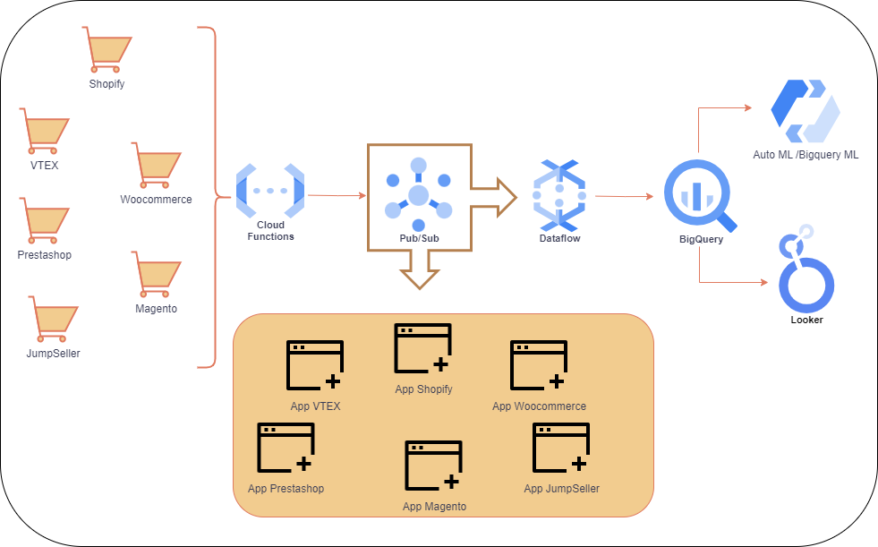
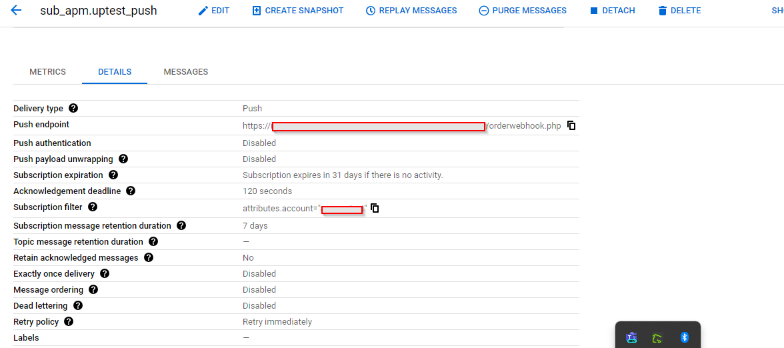
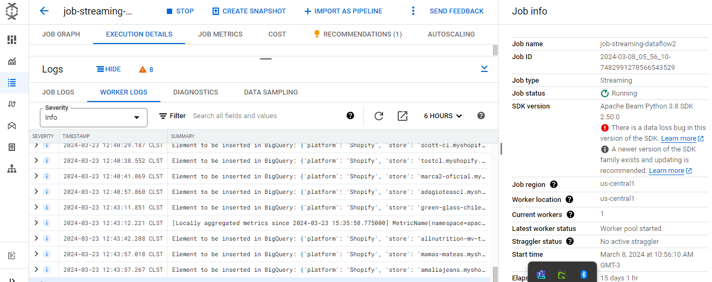

# Caso de Estudio Integraciones Ecommerce

## Problemática
Como parte de una empresa transportista (Courier de última milla), el primer proceso para su puesta en marcha (transportación y entrega de productos) es la captura de órdenes en tiempo real desde distintas plataformas de comercio electrónico que están asociadas a la misma. La problemática existente era que las distintas órdenes se cargaban inicialmente a través de un Excel de forma manual en el sistema. Esto funcionaba cuando había pocos clientes y el volumen de ventas era además bajo. Sin embargo, cuando el número de clientes (comercio electrónico asociados) así como el volumen de ventas creció, se hizo insostenible mantener un modelo de carga manual.

Por cada orden en el Excel, había que introducir manualmente todos los datos de una orden, como son nombre del comprador, nombre del producto, SKU, método de envío, dirección de entrega, teléfono, y muchos más datos. Cabe destacar que las tiendas asociadas no manejan la misma plataforma; inicialmente era solamente Shopify, pero después se incorporaron clientes que utilizaban WooCommerce, VTEX, PrestaShop, Magento, JumpSeller, así como tiendas con desarrollos propios, lo que implicaba que el origen de la información nunca era el mismo y se necesitaba de un “sistema” que pudiera leer de alguna manera de forma automática cada vez que se generaba una orden en tiempo real en lugar de ser cargadas en un Excel al final del día.

En este punto, se analiza qué arquitectura o sistema podría dar solución a una demanda creciente tanto de clientes, como de órdenes, como de plataformas de comercio electrónico, que pudiera además ser escalable en tiempo real cuando existan fechas de altas ventas como Navidad, Black Friday, promociones, etc.

El segundo problema es que las órdenes, al ser cargadas de forma manual y masiva, eran muy propensas a la introducción de errores, traduciéndose en largos procesos de verificación en el sistema transportista, así como de costos asociados.

## Propuesta de Solución
Inicialmente, se investigaron las formas en que cada plataforma de comercio electrónico podía notificar a través de un webhook propio a un sistema externo, el cual podría ser nuestra empresa transportista con un endpoint escuchando cada creación de venta. En la mayoría de plataformas más modernas, sí existía este webhook configurado pero en otras no, por lo que el primer desafío fue construir un plugin personalizado en aquellas plataformas que lo requerían para poder notificar a un sistema externo. Resuelto este primer punto, se comienza el desarrollo de aplicaciones personalizadas por parte de la empresa transportista, donde podían recibir las notificaciones de las distintas tiendas de las diversas plataformas. 

Cabe destacar que en una misma plataforma se tienen muchos clientes con tiendas diferentes y aquí el formato de información sea igual según la plataforma; existía una diversidad de lógicas que cada cliente tenía y que había que separar en hilos distintos. Por ejemplo, una tienda solo nos entregaba productos de Regiones y no de RM, por lo que había que hacer esta distinción para no dejar entrar en el sistema del transportista órdenes de RM. Otras tiendas, sin embargo, indicaban que ciertos SKUs fueran excluidos o métodos de envío, o bien se desarrollaban lógicas de multi-bultos más profundas. Por lo que era necesario que los endpoints fueran distintos por cada tienda y por cada plataforma, lo que agregaba particularidades propias al desarrollo individual.

Una vez obtenida en cada aplicación correspondiente la información de las ventas en tiempo real separadas por tiendas, comienza el siguiente desafío. Resulta que los webhooks de las plataformas de comercio electrónico tienen sus propias reglas, pongamos el caso de Shopify que es el más conocido, este webhook se encarga de enviar la notificación en tiempo real transmitiendo todo el cuerpo de la orden en formato JSON. Sin embargo, si el endpoint que lo recibe no debe tardar en responder a dicho webhook con una notificación exitosa 200 OK porque si no lo hace de inmediato (unos 6 segundos) el propio webhook reenvía el mensaje reiteradamente 19 veces luego de la cual elimina el webhook y se “cae” el recibimiento de órdenes en tiempo real.

Nuestro endpoint que recibe el mensaje JSON de una orden solo puede responder cuando ha procesado toda la información, por lo que al notificar de vuelta al webhook, ya era demasiado tarde. Hay que tener en cuenta que se recibe un objeto JSON crudo, el cual hay que desagregar y obtener solamente la información que es relevante para el sistema transportista, aplicar los filtros y exclusiones propias de cada tienda, así como enviar mediante una solicitud POST al sistema transportista la orden procesada.

En muchos casos, cuando no se perdía la conexión con el webhook, lo que sucedía era que se duplicaban las órdenes en el sistema transportista, incluso hasta cuatro veces, debido a las repeticiones enviadas continuamente del mismo objeto JSON por parte del webhook. Esta forma de comportamiento del webhook, que no se puede modificar, no es más que una medida de seguridad y de rendimiento por parte del comercio electrónico y es correcta conceptualmente, pero introducía una gran problemática a resolver: la duplicación de órdenes.

## Uso de Herramientas de Google Cloud Platform

**Pub/Sub:** Ante la problemática de duplicación de órdenes y la necesidad de responder inmediatamente a los webhooks, se eligió Pub/Sub por su capacidad de manejar mensajería eficazmente, permitiendo responder al webhook de forma inmediata y procesar la información sin prisa. Esto elimina el problema de duplicación y facilita la gestión de órdenes en tiempo real.

**Cloud Functions:** Para plataformas sin integración directa con Pub/Sub, se implementaron Cloud Functions como un paso intermedio, recibiendo las notificaciones y publicándolas en Pub/Sub. Esto garantiza la continuidad y fiabilidad del flujo de datos.

**Dataflow:** La información fluye hacia Dataflow, donde se estructuran y procesan los datos de las órdenes mediante pipelines de Apache Beam, preparándolos para su almacenamiento en BigQuery. Esto permite una gestión escalable y eficiente del volumen de datos.

**BigQuery:** Se utiliza para almacenar datos históricos de las órdenes, facilitando el análisis y la extracción de insights relevantes. La integración de BigQuery con herramientas de Machine Learning, como BigQuery ML y AutoML, posibilita la implementación de modelos predictivos y de clasificación directamente sobre los datos almacenados, sin necesidad de moverlos a otro entorno.

**Looker Studio:** Para la visualización de datos y la creación de informes, se emplea Looker Studio, permitiendo a los stakeholders acceder a insights de negocio de manera intuitiva y en tiempo real.

A grandes rasgos, así es como se implementa una arquitectura donde la información fluye de forma natural, evitando errores de manipulación y retrasos. Por otra parte, se necesita que la información no solo fluya hacia el sistema transportista sino que también sea guardada de forma histórica para que sea relevante extraer información de la misma. Por lo cual, Pub/Sub trabaja en doble sentido, enviando la orden a cada aplicación individual del sistema transportista y guardando un histórico.

Para ello, envía la información a un job de Dataflow (a través de un pipeline de Beam) con todos los datos de la orden y especificando la fuente de donde viene, para que este pueda insertarla en BigQuery posteriormente y proceder a realizar Machine Learning con BigQuery ML y AutoML, así como la creación de una herramienta de reportes con Looker Studio.
